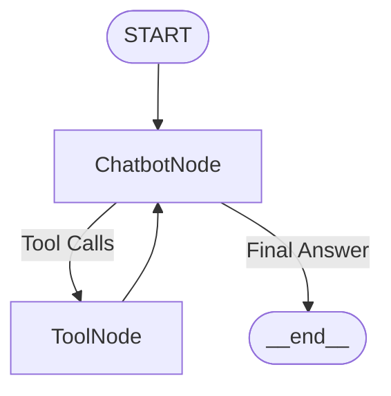

# 🧠 Data Analyst Bot

## 💡 Multi-Agent AI Assistant using LangGraph, SQL, and RAG

An intelligent assistant powered by **LangChain**, **LangGraph**, and **Groq’s LLaMA 70B**, capable of answering complex natural language queries using:

* SQL querying (Airline & Chinook databases)
* RAG (Swiss Airline Policy & Story documents)
* Web Search (via Tavily API)
* Multi-tool routing with LangGraph

---

## 🚀 Features

* 💬 Conversational LLM Agent (`deepseek-r1-distill-llama-70b` via Groq)
* 🧳 SQL Agents:

  * ✈️ Airline loyalty database (SQLite)
  * 🎵 Chinook music database (SQLite)
* 📚 RAG Agents:

  * 📘 Swiss Airline Policy documents
  * 📖 Fictional Story Corpus
* 🌐 Web Search Agent (via Tavily)
* 🧠 LangGraph orchestration for tool routing with retries
* 🧾 Chroma Vector Store + HuggingFace Embeddings
* 🔐 Easy setup with `.env` and YAML config files

---

## 📁 Project Structure

```
data_analyst_bot/
├── configs/
│   ├── project_config.yml
│   └── tools_config.yml
├── data/
│   ├── airline.sqlite
│   ├── Chinook.db
│   ├── airline_policy_vectordb/
│   ├── stories_vectordb/
│   └── unstructured_docs/
├── images/
├── memory/
├── src/
│   ├── app.py                # Entry point
│   ├── prepare_vector_db.py  # For building RAG vector stores
│   ├── utils/
│   ├── chatbot/
│   │   ├── chatbot_backend.py
│   │   ├── load_config.py
│   │   └── memory.py
│   └── agent_graph/
│       ├── agent_backend.py
│       ├── build_full_graph.py
│       ├── load_tools_config.py
│       ├── tool_chinook_sqlagent.py
│       ├── tool_travel_sqlagent.py
│       ├── tool_lookup_policy_rag.py
│       ├── tool_stories_rag.py
│       └── tool_tavily_search.py
├── .env
├── requirements.txt
├── LICENSE
├── README.md
└── sample_questions.txt
```

---

## 🧠 LangGraph Workflow



* **ChatbotNode**: Routes and interprets queries
* **ToolNode**: Executes one of:

  * SQL Agent (Airline / Chinook)
  * RAG Retriever (Policy / Story)
  * Web Search
* Repeats until final answer is formed

---

## 🛠️ Installation

### 1. Clone the repository

```bash
git clone https://github.com/your-username/data_analyst_bot.git
cd data_analyst_bot
```

### 2. Create a virtual environment

```bash
conda create -n ai_agents python=3.10 -y
conda activate ai_agents
```

### 3. Install dependencies

```bash
pip install -r requirements.txt
```

### 4. Configure `.env`

Create a `.env` file in the root:

```
GROQ_API_KEY=your_groq_key
TAVILY_API_KEY=your_tavily_key
```

---

## ⚙️ Tool Configuration (configs/tools\_config.yml)

```yaml
primary_agent:
  llm: deepseek-r1-distill-llama-70b
  llm_temperature: 0.0

swiss_airline_policy_rag:
  unstructured_docs: "data/unstructured_docs/swiss_airline_policy"
  vectordb: "data/airline_policy_vectordb"
  collection_name: rag-chroma
  embedding_model: sentence-transformers/all-MiniLM-L6-v2
  chunk_size: 500
  chunk_overlap: 100
  k: 2

stories_rag:
  unstructured_docs: "data/unstructured_docs/stories"
  vectordb: "data/stories_vectordb"
  collection_name: stories-rag-chroma
  embedding_model: sentence-transformers/all-MiniLM-L6-v2
  chunk_size: 500
  chunk_overlap: 100
  k: 2

travel_sqlagent_configs:
  travel_sqldb_dir: "data/airline.sqlite"

chinook_sqlagent_configs:
  chinook_sqldb_dir: "data/Chinook.db"

langsmith:
  tracing: false

tavily_search_api:
  tavily_search_max_results: 2

graph_configs:
  thread_id: 1
```

---

## ▶️ Run the Assistant

```bash
python src/app.py
```

This will:

* Load all tool configs
* Build LangGraph routing
* Start the conversation loop

---

## 🧪 Sample Prompts

| Query Type    | Example                                             |
| ------------- | --------------------------------------------------- |
| RAG - Policy  | "What is the cancellation policy of Swiss Airline?" |
| RAG - Story   | "Tell me a short story about a haunted plane."      |
| SQL - Airline | "How many female passengers are there?"             |
| SQL - Chinook | "List all artists from the Chinook database."       |
| Web Search    | "Who is the CEO of Groq?"                           |

---

## 📦 requirements.txt

```text
langchain
langgraph
langchain-groq
langchain-chroma
sentence-transformers
chromadb
tavily-python
python-dotenv
pydantic
SQLAlchemy
```

Install all with:

```bash
pip install -r requirements.txt
```

---

## 🧯 Troubleshooting

| Problem               | Solution                                              |
| --------------------- | ----------------------------------------------------- |
| 429 Too Many Requests | You're hitting Groq's limit. Use throttling or delays |
| LangSmith 403         | Set `tracing: false` in YAML                          |
| SQL Hallucinations    | Use `custom_table_info` to limit schema               |
| Chroma Errors         | Rebuild vector DB using `prepare_vector_db.py`        |

---

## 📜 License

MIT License. Feel free to fork, extend, and innovate.

---

## 🤝 Contributing

1. Fork the repository
2. Create a new branch (`git checkout -b feature/my-feature`)
3. Commit your changes
4. Push to the branch and create a PR 🚀

---

## 🙏 Acknowledgments

Thanks to:

* [LangChain](https://www.langchain.com/)
* [LangGraph](https://github.com/langchain-ai/langgraph)
* [Groq](https://console.groq.com/)
* [Chroma](https://www.trychroma.com/)
* [HuggingFace](https://huggingface.co/)
* [Tavily](https://www.tavily.com/)

⭐ Star the repo if this helped you. Let’s build smarter agents together!
